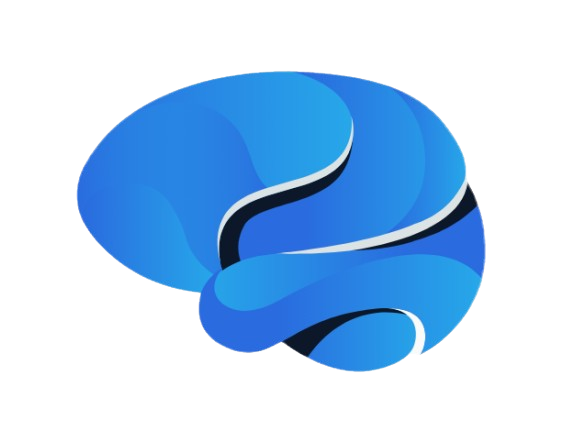

# 📱 KnowledgeMatch App
Welcome to the official repository of the KnowledgeMatch app – a cross-platform mobile app written in Flutter.

### 🚀 Overview
KnowledgeMatch is designed to make learning more social and supportive. Students can create profiles, swipe through potential matches, and send or receive help requests for school-related topics – all within a user-friendly and responsive Flutter app.

### 📲 Features:

- 🔍 Find nearby experts on university subjects
- 📅 Schedule meetings
- ✅ Verified student accounts

### 🚀 Installation
You can download the latest version of the app [here](https://fl-15-241.zhdk.cloud.switch.ch/downloads/app-release.apk).<br>
Open the downloaded file.<br>
Tap Install when prompted.<br>
Once the installation is complete, you can open the app and start using it.

### 🛠️Tech Stack
- Programming languages: Flutter, Dart, Javascript
- Frontend: Flutter
- Backend: Javascript, Firebase, Fastlane
- Database: Firestore, MariaDB
- Deployment Platform: Android, iOS

### 🛠️ Administration
The app includes a dedicated admin screen accessible only to users with administrative privileges. 
This screen provides tools for managing the app's core data and user base efficiently.

#### 👤 Admin Features
- Manage Keywords: Add, edit, or delete keywords that are used in the app for matching or filtering.
- Manage Topics: Update the list of available topics.
- Manage Organisations: Update the list of email domains that can be used for registration.
- User Management: Permanently delete user accounts if necessary.
- Excel Import for Keywords: Instantly import multiple keywords in bulk via an Excel file.
#### 📄 Excel Import Format
When importing keywords, the Excel file must follow this column structure:
```
Keyword Name | Keyword Description | Topic Name (linked)
```

### 🔐 Firebase
Our app integrates with Firebase to handle notifications and real-time data storage.
We use Firebase Cloud Messaging (FCM) to send push notifications to users.
Cloud Firestore is used to store and manage notification data.
This allows real-time syncing and scalability across all devices.


### 📁 Project Structure
This Flutter application follows the MVVM (Model-View-ViewModel) 
architectural pattern for clear separation of concerns and better scalability.
```
lib/
│
├── core/                        # Shared core logic and utilities
├── data/
│   └── services/                # API and backend service classes
│
├── domain/
│   └── models/                  # Application data models
│
├── ui/                          # UI modules grouped by feature
│   ├── [feature]/               # Feature module (e.g., login, home, chat, etc.)
│   │   ├── widgets/             # UI widgets and screen widgets
│   │   ├── view_model/          # ViewModel classes
│   │   └── [feature]_state.dart # Feature-specific state classes
│   │
│   └── core/                    # Reusable UI components and theming
│       ├── themes/              # App-wide theme, colors, constants
│       └── ui/                  # Reusable widgets like drawers, cards
└── main/                        # App entry point and setup
```

### 📄 Backend Documentation
Our backend is a Javascript API that is connected to a MariaDB. <br>
You can find the backend documentation [here](https://gitlab.fhnw.ch/ip34-24vt/ip34-24vt_knowledgematch/KnowledgeMatch_Backend).

### 👥 Team
- Developed by Team Knowledgematch
- Client: Melanie Kropp
- Project for University of Applied Sciences Northwestern Switzerland
